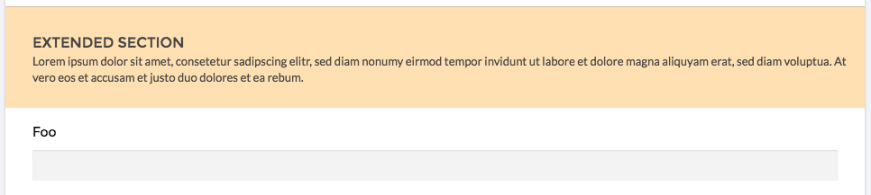

# Statamic extended sections 

[](https://styleci.io/repos/75275568)
[](https://insight.sensiolabs.com/projects/ac1fa74b-994e-4c89-b961-3b9d9b51c59f)

Statamic sections on steroids



## Adding a new color to the addon

 1. **Stylesheet**  
    Open `resources/assets/css/cp.css` and add the new background style.

 2. **Update the fieldtype configuration**  
    Open `src/Fieldtypes/ExtendedSectionFieldtype.php` and append the new color to the background options.

## Install
 1. Add repository to composer.json
 ```
...
"repositories": [
      {
          "type": "git",
          "url": "https://github.com/appswithlove/statamic-extended_section.git"
      }
  ],
...
  
```
  
  2. Require a package 
  ```composer require appswithlove/statamic-extended_section:dev-v3```
